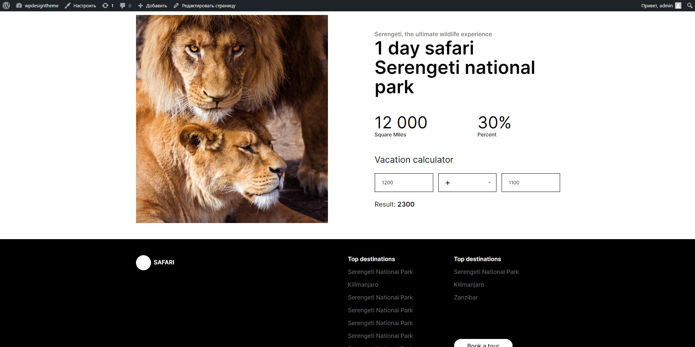

Theme For Wordpress  
Author: Magomed Saybulaev  

Description:  Тема включает два основных блока: калькулятор и слайдер, оба построены с использованием Advanced Custom Fields (ACF). Тема написана с нуля, включает интеграцию с REST API и следует методологии БЭМ. Тема полностью построена на нативном JavaScript.  

Version: 1.0

Slider (ACF):

-- Text + Image

-- Accordion (only text)

Calculator (ACF):

