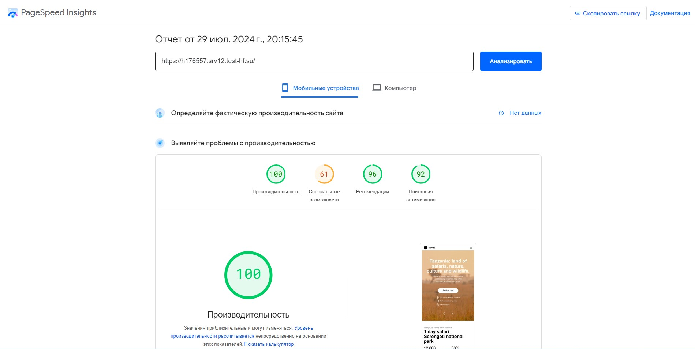

## Theme For Wordpress  
Author: Magomed Saybulaev  
Url: https://h176557.srv12.test-hf.su/  

Version: 2.3

Description:  Тема включает два основных блока: калькулятор и слайдер, оба построены с использованием Advanced Custom Fields (ACF). Тема написана с нуля, включает интеграцию с REST API и следует методологии БЭМ. Тема полностью построена на нативном JavaScript.  

## PageSpeed  
-- Main Page:  
https://pagespeed.web.dev/analysis?url=https%3A%2F%2Fh176557.srv12.test-hf.su%2F  

-- Page Content:  
https://pagespeed.web.dev/analysis?url=https%3A%2F%2Fh176557.srv12.test-hf.su%2Ftop-destinations%2F

## PageSpeed Report:


## Slider (ACF):

-- Text + Image


-- Accordion (only text)


## Calculator (ACF):


## Usage

Write to hosts file
```
#wpdesigntheme.local
127.0.0.1 wpdesigntheme.local
```

## Links

- dev copy: http://wpdesigntheme.local
- database: http://wpdesigntheme.local:8085

## Credentials

MySQL root:

**User**: `root`  
**Password**: `password`

MySQL access:

**User**: `wordpress`  
**Password**: `wordpress`  
**Database**: `wordpress`  
**Host**: `mariadb`

## Directory Structure

* `www` - The web root of your web application.

## Commands

`make help` - Print commands help.  
`make up` - Start containers.  
`make down` - Stop containers.  
`make start` - Start containers without updating.  
`make stop` - Stop containers.  
`make shell` - Access `php` container via shell.  
`make wp` - Executes `wp cli` command in a specified `WP_ROOT` directory (default is `/var/www/html/`).  


